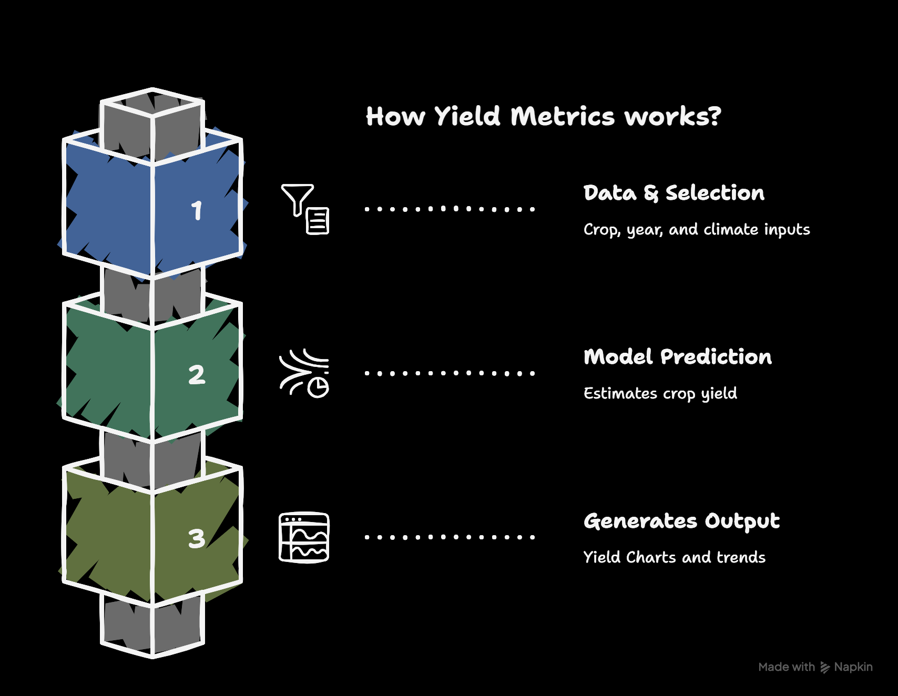
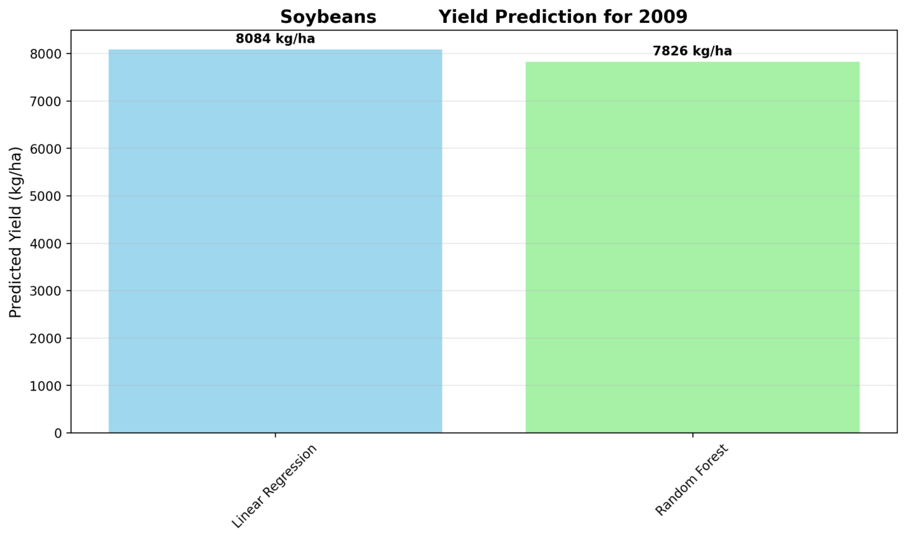
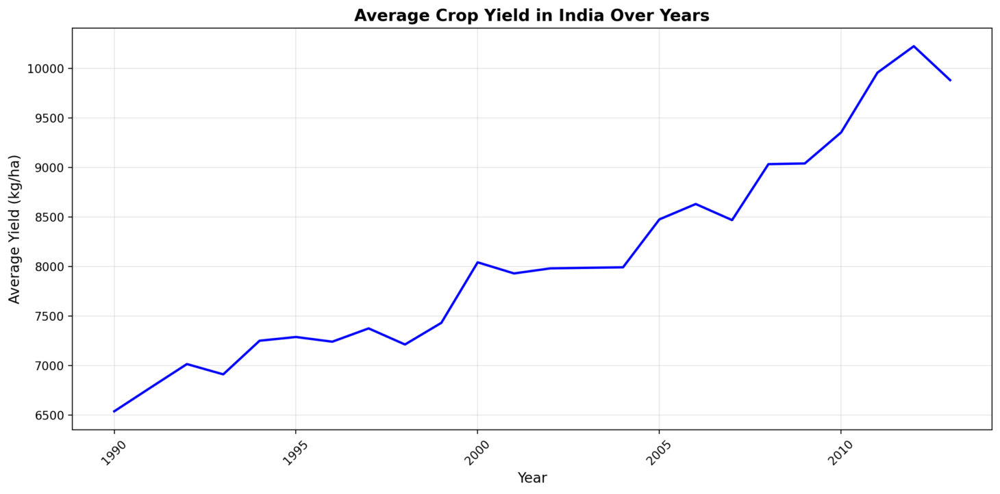

## 🌾 Yield Metrics

Yield Metrics is a Streamlit app that predicts crop yields in India using historical data. It combines rainfall, average temperature, and pesticide usage to estimate yield, and visualizes results for quick comparison and context.

  
  

## What you can do
- Predict yield for a selected crop and year
- See predictions from two models: Linear Regression and Random Forest
- Compare predictions in a bar chart
- View the historical average yield trend over time

## How it works
- Loads crop data (rainfall, temperature, pesticide use) for your selection.
- Predicts yield using two models.
- Shows results and comparisons in charts.

## Data-driven inputs
- Crop list and year range are derived from the dataset.
- Pesticide input defaults to the dataset median and is bounded by dataset min/max.

### Visuals

